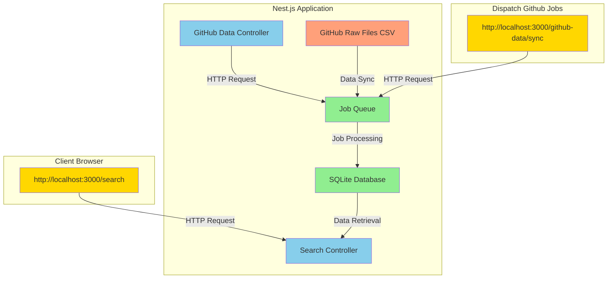

# Architecture



- The application has two main controllers: Search Controller for handling search requests and GitHub Data Controller for triggering data sync jobs.
- The GitHub Data Controller interacts with a job queue (using nestjs/bull with Redis) to enqueue jobs for downloading and processing GitHub data for specific dates.
- The Job Queue (Job Queue (Bull/Redis)) processes jobs asynchronously, downloading CSV files from the GitHub API (GitHub API), parsing the data, and storing it in an SQLite database (SQLite Database).
- The Search Controller retrieves data from the SQLite database based on user queries through the search endpoint (http://localhost:3000/search).
- Users interact with the application through the client browser, sending HTTP requests to the appropriate endpoints.

# Endpoints

| Endpoint         | Method | URL                                                                              | Description                                                                                                                                    | Query Parameters                                                                                                                                                                                                                   |
| ---------------- | ------ | -------------------------------------------------------------------------------- | ---------------------------------------------------------------------------------------------------------------------------------------------- | ---------------------------------------------------------------------------------------------------------------------------------------------------------------------------------------------------------------------------------- |
| Search           | GET    | [http://localhost:3000/search](http://localhost:3000/search)                     | Retrieve and filter repositories based on specific criteria.                                                                                   | - `date`: The date of the ranking in the format "YYYY-MM-DD" (e.g., 2019-02-22).<br/>- `language`: The programming language to filter by (case-insensitive).<br/>- `limit`: The maximum number of values the endpoint will return. |
| GitHub Data Sync | POST   | [http://localhost:3000/github-data/sync](http://localhost:3000/github-data/sync) | Start jobs that download CSV files from the [GitHub Ranking](https://raw.githubusercontent.com/EvanLi/Github-Ranking/master/Data/) repository. | - None                                                                                                                                                                                                                             |

### Responses

`POST http://localhost:3000/github-data/sync`

```json
{
  "message": "1787 jobs created."
}
```

`GET http://localhost:3000/search?date=2018-12-30&language=javaScript&limit=5`

```json
[
  {
    "id": 113446,
    "rank": 1,
    "item": "top-100-stars",
    "repoName": "freeCodeCamp",
    "stars": 296724,
    "forks": 20675,
    "language": "JavaScript",
    "repoUrl": "https://github.com/freeCodeCamp/freeCodeCamp",
    "username": "freeCodeCamp",
    "issues": 5969,
    "lastCommit": "2018-12-30T03:33:39Z",
    "description": "The https://www.freeCodeCamp.org open source codebase and curriculum. Learn to code for free together with millions of people.",
    "reportDate": "2018-12-30"
  },
  {
    "id": 113448,
    "rank": 3,
    "item": "top-100-stars",
    "repoName": "vue",
    "stars": 123494,
    "forks": 17666,
    "language": "JavaScript",
    "repoUrl": "https://github.com/vuejs/vue",
    "username": "vuejs",
    "issues": 207,
    "lastCommit": "2018-12-29T12:27:43Z",
    "description": "🖖 Vue.js is a progressive, incrementally-adoptable JavaScript framework for building UI on the web.",
    "reportDate": "2018-12-30"
  },
  {
    "id": 113449,
    "rank": 4,
    "item": "top-100-stars",
    "repoName": "react",
    "stars": 118660,
    "forks": 21514,
    "language": "JavaScript",
    "repoUrl": "https://github.com/facebook/react",
    "username": "facebook",
    "issues": 527,
    "lastCommit": "2018-12-29T01:11:04Z",
    "description": "A declarative, efficient, and flexible JavaScript library for building user interfaces.",
    "reportDate": "2018-12-30"
  },
  {
    "id": 113454,
    "rank": 9,
    "item": "top-100-stars",
    "repoName": "d3",
    "stars": 81304,
    "forks": 20205,
    "language": "JavaScript",
    "repoUrl": "https://github.com/d3/d3",
    "username": "d3",
    "issues": 9,
    "lastCommit": "2018-12-19T13:16:30Z",
    "description": "Bring data to life with SVG, Canvas and HTML. :bar_chart::chart_with_upwards_trend::tada:",
    "reportDate": "2018-12-30"
  },
  {
    "id": 113455,
    "rank": 10,
    "item": "top-100-stars",
    "repoName": "javascript",
    "stars": 79991,
    "forks": 15287,
    "language": "JavaScript",
    "repoUrl": "https://github.com/airbnb/javascript",
    "username": "airbnb",
    "issues": 133,
    "lastCommit": "2018-12-28T22:32:13Z",
    "description": "JavaScript Style Guide",
    "reportDate": "2018-12-30"
  }
]
```

# Setup

## Dependencies

- Redis (if not installed locally run `docker-compose up`)

## Installation

```bash
$ yarn
```

## Env variables

```bash
$ cp .env.example .env
```

## Running the app

Make sure to run first `POST http://localhost:3000/github-data/sync` before to query data.

```bash
# development
$ yarn start

# watch mode
$ yarn start:dev

# production mode
$ yarn start:prod
```

## Test

```bash
# unit tests
$ npm run test

# e2e tests
$ npm run test:e2e

# test coverage
$ npm run test:cov
```

## Future work

- Consistent schema responses `(erros: { message }, success: { data })`.
- Cache fetch request
- Sync endpoint fetch the missing data (check first in the DB which dates are missing)
- The fetch endpoint allows for a range of dates
